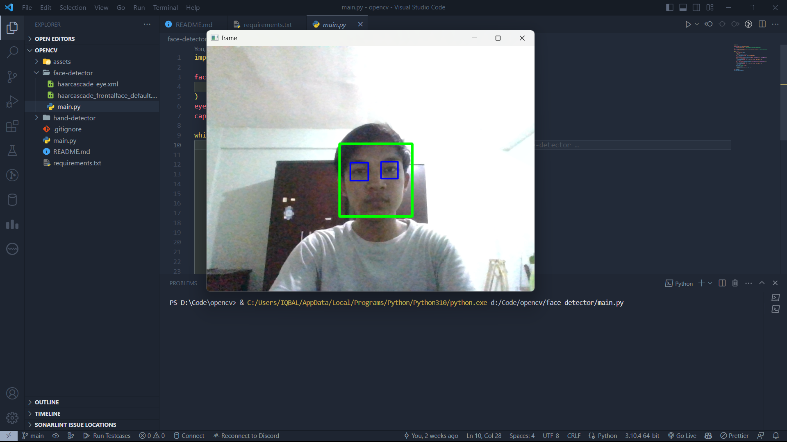
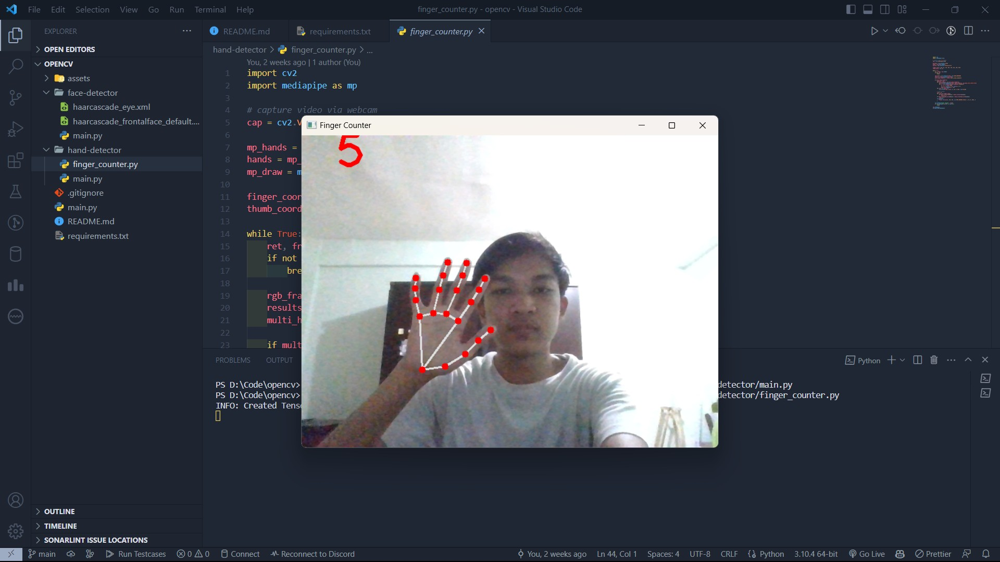

# OpenCV Mini Projects

These are some my exercise creating mini project with opencv python library.

## Face Detector & Eye Detector

This program will create a green rectangle around someone's face and blue rectangle around their eyes. You can find the main program in `/face-detector/main.py`.

## Finger Counter

This program will show the landmarks of the fingers as well as the number of fingers raised. You can find the main program in `/hand-detector/finger_counter.py`.

## How to run

1. Clone this repository
2. Install requirements: `pip install -r requirements.txt`
3. Run the program you choose:
    - Face Detector: `python face-detector/main.py`
    - Finger Counter: `python hand-detector/finger_counter.py`
